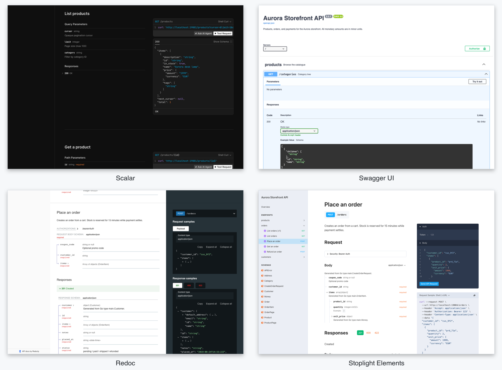

# stdocs

**Languages:** [English](README.md) (canonical) · [Español](README.es.md) · [Català](README.ca.md)

[](https://github.com/FumingPower3925/stdocs/actions/workflows/ci.yml)
[](https://goreportcard.com/report/github.com/FumingPower3925/stdocs)
[](https://pkg.go.dev/github.com/FumingPower3925/stdocs)
[](https://opensource.org/licenses/Apache-2.0)

stdocs turns a standard library `net/http.ServeMux` into a self-documenting API: register routes as usual, and it serves interactive documentation for them — Scalar, Swagger UI, Redoc, or Stoplight Elements at `/docs` — backed by a generated OpenAPI 3.0/3.1/3.2 document. Zero dependencies, no code generation: the patterns you already write are the source of truth.

```go
mux := stdocs.New(stdocs.WithTitle("My API"))
mux.HandleFunc("GET /users/{id}", getUser)
mux.Mount() // docs UI at /docs/, spec at /docs/openapi.json
log.Fatal(http.ListenAndServe(":8080", mux))
```

That's it. `stdocs` walks your registered routes, generates an OpenAPI spec from your Go types, and serves a docs UI at `/docs/`. Coming from swaggo/swag, FastAPI, or a typed-handler framework? [MIGRATING.md](MIGRATING.md) maps your habits onto stdocs.



The same generated document, rendered by each of the four bundled rich UIs — every one available CDN-pinned or fully embedded for air-gapped builds.

## Table of contents

- [Features](#features)
- [Install](#install)
- [Usage](#usage)
- [UIs](#uis)
- [Documentation](#documentation)
- [How it works](#how-it-works)
- [Scope and non-goals](#scope-and-non-goals)
- [Contributing](#contributing)
- [License](#license)

## Features

- **Five UIs** — a tiny dependency-free default (~1.6 KB), plus Scalar, Swagger UI, Redoc, and Stoplight Elements — each CDN-pinned with SRI integrity hashes or fully embedded for air-gapped builds.
- **Three OpenAPI versions** — 3.0.4 (default), 3.1.2, and 3.2.0, all externally validated.
- **Reflection** — Go types become JSON Schemas following the `encoding/json` contract, with documentation and validation rules (`minimum`, `maxLength`, `pattern`, `enum`, `default`, …) read from struct tags.
- **Typed parameters** — declare query/header/cookie parameters from a struct or inline with typed, validated modifiers.
- **Smart defaults** — function names become summaries, path segments become tags, path params and a 200 are auto-documented, secured routes document their 401, and the shared error envelope is declared once mux-wide.
- **Environment control** — turn docs on/off per environment, hide individual routes, and detect try-it console traffic, all without touching registered routes.
- **Honest by default** — invalid documentation input panics instead of publishing a wrong contract, and an opt-in dev middleware warns when handlers drift from the document.
- **TypeScript types, natively** — the `tsgen` subpackage emits the contract as TypeScript declarations from the same model as the document: pure Go, no node toolchain, types only.
- **Zero deps** — only the Go standard library at runtime.

## Install

```bash
go get github.com/FumingPower3925/stdocs
```

Requires Go 1.25 or later. The full reference is also available offline once a source file imports the module (run `go mod tidy` after adding the import): `go doc github.com/FumingPower3925/stdocs`. stdocs follows the Go project's release support policy — the two most recent Go releases, currently 1.25 and 1.26 — and CI runs the full test suite on every patch release of both. The route patterns stdocs documents (`"GET /users/{id}"`) are the method+path syntax that `net/http.ServeMux` gained in Go 1.22.

## Usage

Routes document themselves from the pattern and handler name; struct tags and route opts add the rest:

```go
type CreateTask struct {
    Title    string `json:"title" doc:"Short title" minLength:"1" maxLength:"200"`
    Priority int    `json:"priority" minimum:"1" maximum:"5" default:"3"`
}

type Task struct {
    ID string `json:"id" doc:"Unique ID"`
}

type ListParams struct {
    Cursor string `query:"cursor" doc:"Opaque pagination cursor"`
    Limit  int    `query:"limit" default:"20" minimum:"1" maximum:"100"`
}

type APIError struct {
    Message string `json:"message"`
}

mux := stdocs.New(
    stdocs.WithTitle("My API"),
    stdocs.WithBearerAuth("bearerAuth", "JWT"),
    stdocs.WithDefaultResponse(500, APIError{}), // the error envelope, once
)

mux.HandleFunc("GET /tasks", listTasks, stdocs.WithParams(ListParams{}))

mux.HandleFunc("POST /tasks", createTask,
    stdocs.WithBody(CreateTask{}),
    stdocs.WithResponse(201, Task{}),
    stdocs.WithSecurity("bearerAuth"), // documents the 401 too
)

mux.Mount(os.Getenv("ENV") != "prod")
```

Misdeclared documentation — a typo'd parameter type, a `minLength` on an `int`, an `example` that doesn't parse — panics or refuses to build instead of publishing a wrong contract.

## UIs

Import a sub-package and pass its `WithUI()` option; the `*emb` twins embed the bundle for air-gapped builds:

```go
import "github.com/FumingPower3925/stdocs/ui/scalar"

mux := stdocs.New(stdocs.WithTitle("My API"), scalar.WithUI())
```

| UI                              | CDN sub-package                       | Embedded sub-package                       |
| ------------------------------- | ------------------------------------- | ------------------------------------------ |
| _(default)_ (built-in, ~1.6 KB) | —                                     | —                                          |
| Scalar                          | `ui/scalar` (~3.6 MB from the CDN)    | `ui/scalaremb` (~3.6 MB in your binary)    |
| Swagger UI                      | `ui/swaggerui` (~1.7 MB from the CDN) | `ui/swaggeruiemb` (~1.7 MB in your binary) |
| Redoc                           | `ui/redoc` (~1.1 MB from the CDN)     | `ui/redocemb` (~1.1 MB in your binary)     |
| Stoplight                       | `ui/stoplight` (~2.4 MB from the CDN) | `ui/stoplightemb` (~2.4 MB in your binary) |

CDN URLs are pinned to exact versions with sha384 SRI hashes; sub-packages are not linked into your binary unless imported. Embedded setup details: [Docs UIs](https://pkg.go.dev/github.com/FumingPower3925/stdocs#hdr-Docs_UIs).

## Documentation

The full reference lives on [pkg.go.dev](https://pkg.go.dev/github.com/FumingPower3925/stdocs), organized by topic:

- [Field tags](https://pkg.go.dev/github.com/FumingPower3925/stdocs#hdr-Field_tags) — `doc:`, `example:`, and the constraint vocabulary.
- [Parameters](https://pkg.go.dev/github.com/FumingPower3925/stdocs#hdr-Parameters) — `WithParams` structs and `ParamOpt` modifiers.
- [Responses](https://pkg.go.dev/github.com/FumingPower3925/stdocs#hdr-Responses) — per-status declarations, the `default` response, mux-level error envelopes.
- [Visibility](https://pkg.go.dev/github.com/FumingPower3925/stdocs#hdr-Visibility) — `Hidden`, `Internal`, and `WithInternal(show)`.
- [Mounting and toggling](https://pkg.go.dev/github.com/FumingPower3925/stdocs#hdr-Mounting_and_toggling) — `Mount`/`Docs`, per-environment switches, proxy path prefixes.
- [Try-it requests and drift](https://pkg.go.dev/github.com/FumingPower3925/stdocs#hdr-Try_it_requests_and_drift) — `FromDocs` detection and the `DriftWarn` dev aid.
- [Using the spec downstream](https://pkg.go.dev/github.com/FumingPower3925/stdocs#hdr-Using_the_spec_downstream) — golden-file tests, PR diffing, client generation.
- [TypeScript types](https://pkg.go.dev/github.com/FumingPower3925/stdocs/tsgen) — `tsgen.Generate`, the go:generate recipe, and the committed `api.ts` workflow.
- [OpenAPI versions](https://pkg.go.dev/github.com/FumingPower3925/stdocs#hdr-OpenAPI_versions) — `WithVersion`, 3.2's `$self`, and the `WithOpenAPI` escape hatch.
- [DocsHandler](https://pkg.go.dev/github.com/FumingPower3925/stdocs#DocsHandler) — serve a hand-written spec behind any of the bundled UIs.

[MIGRATING.md](MIGRATING.md) complements the reference with migration guides from swaggo/swag, FastAPI, and typed-handler frameworks — literal mapping tables included.

## How it works

`stdocs.New()` returns a `*stdocs.Mux` that embeds `*http.ServeMux` and records pattern + metadata as you register handlers. On the first request to `/docs/openapi.json`, the registry is walked and the spec is built and cached (`mux.Refresh()` rebuilds). No comments, no code generation, no `unsafe` — the pattern string is the documentation.

A runnable demo lives in [`cmd/demo`](./cmd/demo):

```bash
go run ./cmd/demo
# open http://localhost:8080/docs/
```

## Scope and non-goals

stdocs documents stdlib `ServeMux` applications — it does not integrate with other routers, does not validate requests at runtime, and uses no code generation, comment annotations, or dependencies to understand your Go code, permanently and by design. What it emits — the document, the docs UI, the `tsgen` TypeScript declarations — sits on the other side of that line, and none of it will ever include a runtime client or an npm package. The document describes intent; keeping handlers honest is the application's job. The full boundary statement, including when a different tool fits better, is in the [package documentation](https://pkg.go.dev/github.com/FumingPower3925/stdocs#hdr-Scope_and_non_goals).

## Contributing

See [CONTRIBUTING.md](CONTRIBUTING.md). Translations are community-maintained; see the "Translations" section there to add or update one.

```bash
go test -race -count=1 ./...
golangci-lint run ./...
```

## License

Apache-2.0. See [LICENSE](LICENSE).
